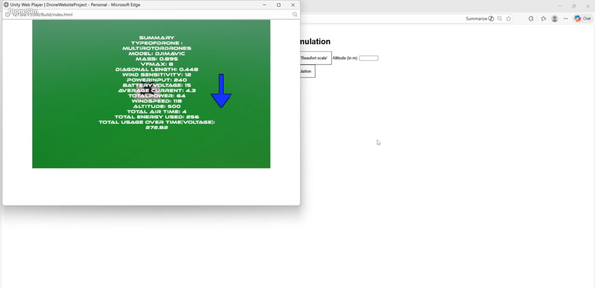

# **DroneTypeStabilitySimulator**

Simulates drone stability using **C++**

**Date:** 12/7 — *Drone Logic Finished*  
**Author:** Luis Andre Matudio Blanco  
**Dependency Documentation:** SQLite3 (https://sqlite.org/docs.html)

---





The goal of this project is to create a visual drone simulator that showcases the stability of various drones. Drone data is stored in a database and accessed through multiple SQL APIs for practice and experimentation.

The documentation for this project is divided into the following chapters:

1. **Python CSV → SQL DB File Maker**  
2. **C++ Drone Simulation**  
   - Drone Struct  
   - SQL Parser  
   - Main Simulation  

---

# **1. Python CSV → SQL DB File Maker**

### **Libraries Used**
- `sqlite3`
- `csv`
- `os`

The CSV file contains categorized drone information.

### **Example Data Format**

| TypeofDrone        | Model     | Mass | VfMax | B     | Wind | PowerInput | BatteryVoltage | AverageCurrent | TotalPower |
|--------------------|-----------|------|-------|-------|------|------------|----------------|----------------|------------|
| MultiRotorDrones   | DJIMavic  | 0.895| 8     | 0.448 | 12   | 240        | 15             | 4.3            | 64.5       |

Example Python snippet used to read CSV data:

```python
listOfDroneInfo = []
with open('SQLmakerFiles/OfficialDroneDoc.csv', newline='') as csvFile:
    spamreader = csv.reader(csvFile, delimiter=' ', quotechar='|')
    for row in spamreader:
        listOfDroneInfo.append(row)
```

# **2. C++ Drone Simulation**

## **Libraries Used**
- `iostream`
- `fstream`
- `vector`
- `cmath`
- `sqlite3.h`

---

## **Setup**

SQLite3 C API files must be present in the `deps/` directory.  
If missing, download the amalgamation files from:  
https://sqlite.org/download.html

**Required files:**
    'shell.c', 'sqlite.c', 'sqlite3.h', sqlite3ext.h'

**Install dependencies (Linux example):**
```
bash
sudo apt update
sudo apt install libsqlite3-dev
g++ -o out main.cpp -lsqlite3
```

##2-a Drone Struct

The drone struct holds drone information (10 variables) and has 3 helper functions

Drone chart with 10 variables with examples for placeholder values

	| type | name | mass | maxSpeed | B | windSens | powInp | batVolt | avgCur | totPow |
    | :--- | :--- | :--- | :--- | :--- | :--- | :--- | :--- | :--- | :--- |
    | MultiRotorDrones | DJIMavic | 0.895 | 8 | 0.448 | 12 | 240 | 15 | 4.3 | 64.5 |	

Helper functions:

Calculations from: https://www.technik-consulting.eu/en/analysis/stable_drone.html

getForce()-Gets the force by taking in an altitude to calculate the acceleration for thrust force the drone needs
	```C++ 
    
double getForce(double altitude)

    {
    
        double a = (pow(maxSpeed, 2))/(2*altitude);
        
        double force = mass * a + mass * 9.8;
        
        return force;
        
    }
    
    
	
getTorque()- Gets the torque by taking in a force and then returning the torque multiplied by the diagonal length (B)
    
	```C++
    
		double getTorque(double force)
        
    {
    
        return force * B;
        
    }
    
    
printInfo()- Fucntion to print drone info
    
	```C++
    
		void printInfo()
        
    {
    
        std::cout << "Type: " << type << " Name: " << name << " Mass: " <<  mass <<std::endl;
        
        std::cout << "MaxSpeed: " << maxSpeed << " B: " << B << " Wind Sensitivity: " <<  windSens <<std::endl;
        
        std::cout << "Power Input: " << powInp << " Battery Voltage: " << batVolt << "  Average Current: " <<  avgCur <<std::endl;
        
        std::cout << "Total Power: " << totPow << std::endl;
        
    }
    
    
#2-b sqlParser

This would obtain the sql info assuming it exists under drone.db with C++’s sqlite3 api obtained from the amalgamation file from sqlite3 docs.

Std::string sqlParser takes in two parameters, std::string for mesg (mainly for getting specific drones but could also be used for other functions in future) and a Droneholder variable by reference

The sql parser then goes on to obtain info in this workflow:
    
    +--------------------------------------------------+
    | Create sqlite3* object and open "drones.db"      |
    +--------------------------------------------------+
                          |
                          v
    +--------------------------------------------------+
    | Prepare SQL statement using provided message     |
    | (mesg)                                           |
    +--------------------------------------------------+
                          |
                          v
    +--------------------------------------------------+
    | Execute sqlite3_step() loop and load data into   |
    | DroneHolder struct                               |
    +--------------------------------------------------+
                          |
                          v
    +--------------------------------------------------+
    | Finalize statement (sqlite3_finalize)            |
    +--------------------------------------------------+
                          |
                          v
    +--------------------------------------------------+
    | Close database (sqlite3_close)                   |
    +--------------------------------------------------+

In any case where it would error out, sqlParser will return a string that states the error to be thrown, otherwise if it passes, it would return a empty string that would get ignored

##2-c Simulation

First user info is gathered

The users valid choice between 3 drones ("DJIMavic", "WingtraOne", "RyzeTello") is recorded then made into a sqlite3 stmt to be fed into the sqlparser

Then environmental variables are gathered:

For windsensitivity of the environment, wind speeds are chosen based on the Beaucraut scale from https://en.wikipedia.org/wiki/Beaufort_scale and the user inputs their number based off the desired test (wind speeds in km/h)

The user then can input a custom altitude based on what distance the user wants in meters (m)

Then using altitude, Drone force and drone torque is calculated

Finally, using the DroneHolder struct, you can find the power limit that is given by powInp and calculate the baseUse via (currDroneTorque) + dr.totPow;
	
Then using a while loop you can simulate the average drone stability by monitoring if its power limit is greater than 0. The powerlimit is deducted by batOut every second.

batOut is set to baseUse, however I added a penalty if the wind sensitivity gathered by Beaucraut’s scale is greater than the drone wind sensitivity leading to an increment by 0.1 every second.

Then after the simulation, the Total Time (s), Total Energy Used (J and calculated via dr.totPow * time), and TotalUsageoverTime (V) as well as the normal drone info given

    +-------------------------------+------------------------------------------------------------------------------------------------------------------------------------------------------------------------------+
    | Step                          | Description                                                                                                                                                                  |
    +===============================+==============================================================================================================================================================================+
    | 1. User Info Gathered         | The user selects one of three drones: "DJIMavic", "WingtraOne", or "RyzeTello".                                                                                              |
    |                               | Their valid choice is recorded and converted into an SQLite3 statement to be passed into the SQL parser.                                                                     |
    +-------------------------------+------------------------------------------------------------------------------------------------------------------------------------------------------------------------------+
    | 2. Environment Variables      | Wind sensitivity input is collected. The user selects a Beaufort-scale wind speed (km/h) based on:                                                                            |
    |    Gathered                   | https://en.wikipedia.org/wiki/Beaufort_scale.                                                                                                                                |
    |                               | The user also provides a custom altitude (meters).                                                                                                                            |
    +-------------------------------+------------------------------------------------------------------------------------------------------------------------------------------------------------------------------+
    | 3. Force & Torque Calculation | Using the provided altitude, the drone's force and torque are calculated mathematically.                                                                                      |
    +-------------------------------+------------------------------------------------------------------------------------------------------------------------------------------------------------------------------+
    | 4. Power Limit Determination  | With the DroneHolder struct, the power limit (`powInp`) is retrieved.                                                                                                         |
    |                               | Base power usage is calculated as:                                                                                                                                            |
    |                               |                                                                                                                                                                              |
    |                               |      baseUse = currDroneTorque + dr.totPow                                                                                                                                    |
    +-------------------------------+------------------------------------------------------------------------------------------------------------------------------------------------------------------------------+
    | 5. Stability Simulation       | A loop simulates drone stability by monitoring remaining power.                                                                                                               |
    |                               | The loop runs while the drone's power limit > 0.                                                                                                                              |
    |                               | Every second, powerlimit is reduced by `batOut`, which defaults to `baseUse`.                                                                                                 |
    |                               | A penalty of +0.1 is added per second to `batOut` if:                                                                                                                         |
    |                               |                                                                                                                                                                              |
    |                               |      (Beaufort wind >= drone wind sensitivity)                                                                                                                                |
    +-------------------------------+------------------------------------------------------------------------------------------------------------------------------------------------------------------------------+
    | 6. Simulation Output          | After simulation ends, the program reports:                                                                                                                                   |
    |                               |  • Total Time (seconds)                                                                                                                                                       |
    |                               |  • Total Energy Used (Joules), via:                                                                                                                                           |
    |                               |                                                                                                                                                                              |
    |                               |        totalEnergy = dr.totPow * time                                                                                                                                         |
    |                               |  • TotalUsageOverTime (voltage)                                                                                                                                                |
    |                               |  • All normal drone info                                                                                                                                                      |
    +-------------------------------+------------------------------------------------------------------------------------------------------------------------------------------------------------------------------+

This information before 12/20 was displayed when the program ran, but with front end components with html being added, the info would be written to a file within a unity build in 3. Front-end Visualization.

# **3. Front-end Visualization**
## **Requirements

Need a out program to be generated from main.cpp with the command "g++ -o out main.cpp -lsqlite3" 'Follow instructions on how to set that up in 2. C++ Drone Simulation

## **Steps for simulation run

#1-Setting up the node.js express app

Install node with

'''
    npm init -y
    npm install express cors
'''

In the same folder as server.js, run node server.js

#2-Running the html

Select the index.html within the DroneTypeStabilitySimulator folder and visit the web page, you should be able to run the simulation and see the visual results!

## **Rundown on the components of the front end

First we have the html, which just holds the input elements for all the main values for the c++ backend to get (Drone name, Wind speed and Altitude), then the html passes that info to app.js 

app.js will capture the drone name, wind speed and altitude as variables. Then the fetch function is called for a url that serves as the node server within server.js

fetch is an interface that essentially serves to fetch resources from networks, which will work in our case specifically for server.js


Within the server.js, when it is run with 'node server.js', an express app is made, which essentially works to handle http requests, specifcally from fetch. Express is part of the node package which also includes crucial modules to help run c++ on locally hosted html websites due to the difference in C++ and js's architecture


     +--------------------------------------------------+
    | Software/Networking (js essentially)             |
    +--------------------------------------------------+
                          |
                          v
    +--------------------------------------------------+
    | Hardware level (c++)                             |
    +--------------------------------------------------+


The node package comes with exec, which can actually run a c++ script with CLI on a local server on a PC. However, this isnt possible to use within a locally hosted HTML website due to the fact that it doesnt have resources to allocate to C++. Thus with express, you can create a local server that could run a local c++ program (out.exe) that can be called by a html website (However it is locally dependent on the same network however there are resources to expand this for free like backend repo).


    +--------------------------------------------------+
    | Software/Networking (js essentially)             |
    +--------------------------------------------------+
                          |
                          v
    +--------------------------------------------------+
    | Middleware (express->exec)                       |
    +--------------------------------------------------+
                          |
                          v
    +--------------------------------------------------+
    | Hardware level (c++)                             |
    +--------------------------------------------------+


So within the HTML, assuming the info is inputted, when the run simulation button is called, app.js would fetch the url for server.js and pass the info to be run on html then the C++ would go on to write the info to the Unity webgl program files within the build.


The unity webgl package primarily serves as a visualization of the drone stability which was the whole point of "3. Front-end Visualization". It reads a file within its folders that contains the results of the HTML site, then gets the drone model (made with basic unity assets since I need to learn blender eventually) and then runs the simulation.

Note: While I will not make the unity files public, I did use Unity Web requests to obtain the files written by the C++ program. Web requests essentially work as a IO file reader however works with html applications. Possible by the Application.streamingAssetsPath attribute that essentially works as a consistant storage location for files to be written to. However when the file is written to, a new page has to open because otherwise the html app will restart.


```css
    string finalPath = System.IO.Path.Combine(Application.streamingAssetsPath, "DroneInfo.txt");

        debugHeader.GetComponent<TextMeshProUGUI>().text = "Loading: " + finalPath;

        using(UnityWebRequest www = UnityWebRequest.Get(finalPath))
        {
            yield return www.SendWebRequest();

            if(www.result != UnityWebRequest.Result.Success)
            {
                Debug.LogError("Error reading file: " + www.error);
                debugHeader.GetComponent<TextMeshProUGUI>().text ="Error loading from: " + finalPath;
            }
            else
            {
                string fileContent = www.downloadHandler.text;
                ReadFile(fileContent);
                InitializeDrone();
            }
        }
```


So in summary the simulation with full visualization follows this form:


    +------------------------------------------------------------------------------------------------------------------------------------------------------------------------------+
    | Step                              | Description                                                                                                                                  |
    +===================================+==============================================================================================================================================+
    | 1. Database & Dependency Setup    | Install necessary Python dependencies.                                                                                                       |
    |                                   | Set up the `drones.db` database from the provided `drone.csv` file by running the `sqlMaker` script located in the `SQLmakerFiles` folder.   |
    +-----------------------------------+----------------------------------------------------------------------------------------------------------------------------------------------+
    | 2. C++ Compilation                | In the main folder, compile the C++ source code into an executable named `out`.                                                              |
    |                                   | Run the terminal command: `g++ -o out main.cpp -lsqlite3`. (Note: The output file must be named `out` for the system to recognize it).       |
    +-----------------------------------+----------------------------------------------------------------------------------------------------------------------------------------------+
    | 3. Server Initialization          | Initialize the backend server from the main folder.                                                                                          |
    |                                   | Run the terminal command: `node server.js` to open the server connection.                                                                    |
    +-----------------------------------+----------------------------------------------------------------------------------------------------------------------------------------------+
    | 4. Client-Side Simulation         | Locally host the `index.html` file (e.g., using the Live Server extension in VSCode).                                                        |
    |                                   | Test if the simulation operates correctly by inputting your specific test values into the interface.                                         |
    +-----------------------------------+----------------------------------------------------------------------------------------------------------------------------------------------+


Credits: Luis Blanco 11/26-12/26


Also this is my first real github project so I would really appreciate feedback of how well I implemented my project. Pls follow me on linkedin too that helps: https://www.linkedin.com/in/luis369


